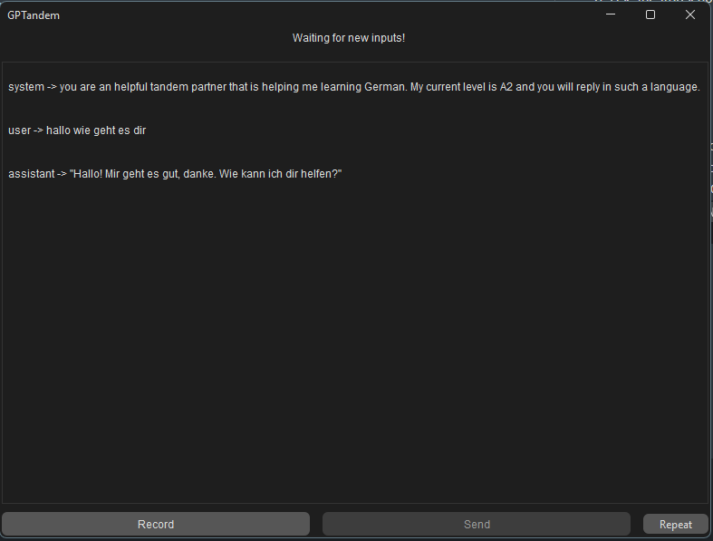

# GPTandem

The idea is to leverage AI capabilities to create an artificial tandem partner.  
The application is built using Java and Swing.

## Flow
1. Record voice input
2. Send audio to Google (speech-to-text) in order to obtain a transcript of what the user said
3. Use the transcript to query OpenAI APIs (chatGPT 3.5) to obtain a textual response
4. Use Google TTS APIs to obtain an audio version of ChatGPT response
5. Repeat

## Note
In order to use the program you must provide your own Google and OpenAI tokens as the services are paid to use.
Google uses a JSON file, and the path to the file must be provided using the env. var. GOOGLE_APPLICATION_CREDENTIALS, for
openAI the env. var. to set is OPENAI_KEY  

